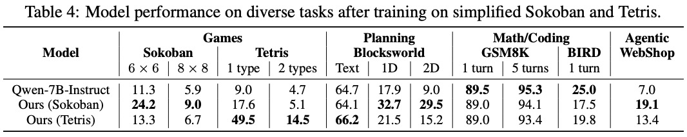
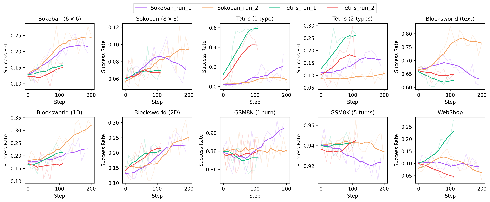

<div align="center">

# GRL: Game Reinforcement Learning for Post‑training LLMs

<em>Game Reinforcement Learning (GRL) for post‑training large language models</em>

</div>

<div>
<br>

<div align="center">


[](https://github.com/lmgame-org/GRL)
[](https://lmgame.org) 
[](https://arxiv.org/abs/2505.15146)
[](https://x.com/haoailab)
[](https://discord.gg/x3dTHfyRZE)

</div>

</div>

GRL (Game Reinforcement Learning) is an open‑source framework that post‑trains LLMs via multi‑turn reinforcement learning on games, yielding general gains across diverse benchmarks.

## Release
<strong>[2025/08/13]</strong> We release GRL to reproduce the paper’s results and to demonstrate general gains across benchmarks by post‑training LLMs via reinforcement learning.

## Tunix Quick Test

Quickly run an end‑to‑end multi‑turn PPO rollout + training loop with Tunix (Qwen2.5‑0.5B‑Instruct on Sokoban). This uses minimal defaults and logs metrics to W&B.

### 1) Clone and enter repo
```bash
git clone --recurse-submodules https://github.com/lmgame-org/GRL.git
cd GRL
git checkout -b tunix_integration_dev_test origin/tunix_integration_dev_test
```

### 2) Create environment
```bash
conda create --name grl python=3.11 -y
conda activate grl
```

### 3) Install dependencies (Tunix mode)
```bash
source scripts/install_submodules.sh --tunix
pip install -e .
```

### 4) Set required environment variables
```bash
export WANDB_API_KEY=your_wandb_api_key     # or: export WANDB_MODE=disabled
export WANDB_ENTITY=your_wandb_entity       # e.g., your W&B org/user
export HF_TOKEN=your_huggingface_token      # needed to download model weights
```

### 5) Launch the quick test (defaults to Qwen2.5‑0.5B; supports 4 TPU v4 with mesh (2,2))
```bash
source train_ppo_multi_turn_script_exp.sh
```


### Adjust training hyperparameters (tunix_base.yaml)

Edit `configs/tunix_base.yaml` to freely tune training without touching code. Key sections:

- rollout: agent grouping, validation set, filtering, reward normalization
- ppo: PPO knobs (epochs, minibatch, gamma, lambda, entropy, clip ratios, kl method)
- training: optimizer (lr, betas, weight_decay), grad_accum, eval cadence, checkpointing
- rollout_runtime: generation length and sampling (temperature, top_p/top_k)
- model.repo_id: base model to download

Notes:
- Set `training.max_steps` or `training.eval_every_n_steps` to positive integers to force values; use `-1` to let the script compute defaults.
- The script composes `tunix_base.yaml` with `configs/agents.yaml` via defaults and prints the merged configuration at startup.


## Installation

   ```bash
   # clone the repo
   git clone --recurse-submodules https://github.com/lmgame-org/GRL.git
   cd GRL

   # create a conda environment
   conda create --name grl python=3.10
   conda activate grl

   # install all dependencies
   source scripts/install_submodules.sh
   # avoid compiling flash-attn from source
   pip install torch==2.7.0 --index-url https://download.pytorch.org/whl/cu128
   pip install flash-attn==2.8.0.post2 --no-build-isolation
   pip install -e .

   # export environment variables
   export WANDB_API_KEY=your_wandb_api_key
   export WANDB_ENTITY=your_wandb_entity
   export HF_TOKEN=your_huggingface_token
   ```


### Optional: Install Datasets
If you want to reproduce paper results and validate BIRD SQL performance or WebShop full dataset performance:
```bash
source scripts/install_dataset.sh --all
```

## Quick Run

For quick experimentation:
Trains on 6×6 (1‑box) Sokoban and evaluate the transferability to Tetris, Blocksworld, and GSM8K.

```bash
source quick_train_qwen_halfb.sh
```

## Training Examples

### General gains of LLM ability from game RL training (paper‑reported results)




### Expected Observed validation success rate curves (examples)





> **Note:** RL training results may fluctuate relative to reported results, but the overall trend and gains remain consistent.

**Sokoban Agent Training:**
```bash
source examples/sokoban_ppo/qwen_7b.sh
```

**Tetris Agent Training:**
```bash
source examples/tetris_ppo/qwen_7b.sh
```

> **Note:** BirdAgent may wait on SQLite file readiness or locks; heavy SQL can stall rollouts and prolong validation. 

### Hardware Configuration

The framework is pre‑configured for different GPU setups:

| GPU Type | GPUs | Agent Groups | Group Size | Total Agents | Default Model | Task |
|---|---:|---:|---:|---:|---|---|
| A100 | 1 | 8 | 16 | 128 | Qwen/Qwen2.5-0.5B-Instruct | Sokoban |
| L40 | 1 | 4 | 8 | 32 | Qwen/Qwen2.5-0.5B-Instruct | Sokoban |
| A100 | 8 | 8 | 16 | 128 | Qwen/Qwen2.5-7B-Instruct | Sokoban |
| H200 | 4 | 8 | 16 | 128 | Qwen/Qwen2.5-7B-Instruct | Sokoban |
| A100 | 8 | 8 | 16 | 128 | Qwen/Qwen2.5-7B-Instruct | Tetris |


> **Note:** The framework automatically scales based on available hardware. Adjust parameters in the training scripts for best performance on your setup.

## Supported Games and Agents

- **Sokoban**: Puzzle-solving game requiring spatial reasoning
- **Tetris**: decision‑making and planning
- **GSM8K**: Mathematical reasoning tasks
- **BlocksWorld**: Logical planning and manipulation
- **WebShop**: E‑commerce navigation and decision‑making
- **BIRD**: SQL query generation and database reasoning

## Documentation
- **[Tutorial](docs/TUTORIAL.md)** - Contributing and development workflow
- **[System Design Overview](docs/SYSTEMDESIGN.md)** - Architecture and design principles
- **[Development Guide](docs/DEVELOPMENT.md)** - Contributing and development workflow

## Acknowledgments

Our work is powered by [VERL](https://github.com/volcengine/verl), an open‑source RLHF library, and draws insights from [Ragen](https://github.com/RAGEN-AI/RAGEN).

## Citation
If you find this repository helpful, please kindly cite:
```
@article{hu2025lmgame,
  title={lmgame-Bench: How Good are LLMs at Playing Games?},
  author={Hu, Lanxiang and Huo, Mingjia and Zhang, Yuxuan and Yu, Haoyang and Xing, Eric P and Stoica, Ion and Rosing, Tajana and Jin, Haojian and Zhang, Hao},
  journal={arXiv preprint arXiv:2505.15146},
  year={2025}
}
```

## License

This project is licensed under the MIT License - see the [LICENSE](LICENSE) file for details.
