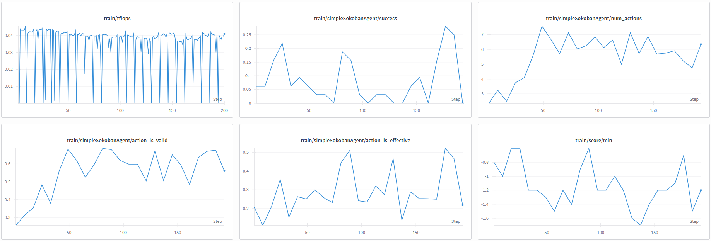

Tunix Integration Updates (08/21): 
A sample of training curve: https://wandb.ai/gamebench/tunix/runs/ucwaqwxo?nw=nwuseryuxuan_zhang13
1. out of memory error
the number of heads of qwen 2.5 0.5b is 14, mesh (1, 4), tensor parallelism can't split the weight
tpu memory is not enough with a large prompt length and generation steps from sokoban env interactions

2. Tunix prompt_id, prompt_mask, completion_ids, and completion_mask conversion
================================= Rollout Trajectory =================================
0:<|im_start|>, 1:s1, 2:s2, 3:s3, 4:<|im_end|>, 5:<|im_start|>, 6:s4, 7:s5, 8:s6, 9:<|im_end|>, 10:<|im_start|>, 11:s7, 12:s8, 13:s9, 14:<|im_end|>
input_ids: [0,1,2,3,4, 5,6,7,8,9, 10,11,12,13,14]
loss_mask = [0,0,0,0,0, 1,1,1,1,1, 1,1,1,1]
reward_scores:[0,0,0,0, 0,0,0,0,0, 0,0,0,0,total_r]

================================= Tunix Rollout Trajectory =================================
fc_prompt = [0,1,2,3,4,5,6,7,8,9,10,11,12,13]
fc_completion = [1,2,3,4,5,6,7,8,9,10,11,12,13,14]
prompt_ids     = last 8 of fc_prompt -> [6,7,8,9,10,11,12,13]
prompt_mask    = [1,1,1,1,1,1,1,1]
completion_ids   = fc_completion
completion_mask  = loss_mask
                = [0,0,0,0,0,1,1,1,1,1,1,1,1,1]
eos_idx = 9 - 1 = 8

Shapes: Rollout batch → input_ids [B, L], loss_mask [B, L-1], reward_scores [B, L-1]; Tunix converted → prompt_ids [B, Pmax], prompt_mask [B, Pmax], completion_ids [B, L-1], completion_mask [B, L-1], eos_idx [B], completion_plus_one_mask [B, L-1].

3. critic model (one more linear layer)
I maually added a linear layer to support final value prediction. 

4. validation problem
eval_per_step implementation details are unclear for me 
how can we support different environment evaluation? 

